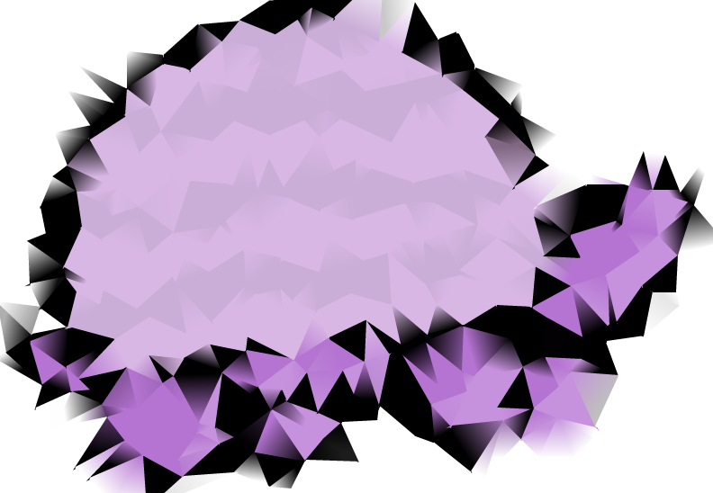

# Purple.jl

 

> It's interpreters all the way down.

This package implements an interesting staging mechanism in Julia -- for a pure subset of Julia functions, it allows _lifting_ of a function defined by signature `f : R -> R` to a function defined by signature `f : Sym{R} -> Term` where `Sym{R}` is a [SymbolicUtils.jl value](https://symbolicutils.juliasymbolics.org/#creating_symbolic_expressions) and `Term` is a [SymbolicUtils.jl term](https://symbolicutils.juliasymbolics.org/api/#symbols_and_terms).

## Background

Julia has a wonderfully hackable compiler -- but after type inference, the current pipeline prevents users from exiting and re-entering the pipeline with inferred code. This is for good reason -- unsafe manipulations outside of the context of type inference will invalidate inference and/or otherwise prevent the compiler from ensuring that invariants required by inference hold. Additionally, because the natural place after inference/optimization for code is the runtime cache -- this use case of "leave and go again" is not sufficiently important to avoid careful consideration.

This package is a small attempt to remedy this issue by converting `executors` (e.g. functions which execute purely and have a natural denotational semantics from some mathematical space to another) into `stagers` (functions which don't execute normally, but instead create symbolic traces of execution).

Because runtime flows know the types of values which enter into callsites, a `stager` can create a typed symbolic representation of the runtime flow. This typed symbolic representation can be further compiled by re-emitting `Expr` instances, or otherwise operated on with the utilities of the [JuliaSymbolics](https://juliasymbolics.org/).

At least, that's the intent -- as with all speculative compiler packages, this one is bound to have some thorns.

> For user who are familiar with [Mjolnir.jl](https://github.com/FluxML/Mjolnir.jl) -- the idea is somewhat similar, except we rely upon Julia's native inference and optimization pipeline (which thus guarantees some modicum of stability).

## The Collapse

This package is inspired by [Collapsing Towers of Interpreters](https://www.cs.purdue.edu/homes/rompf/papers/amin-popl18.pdf).
